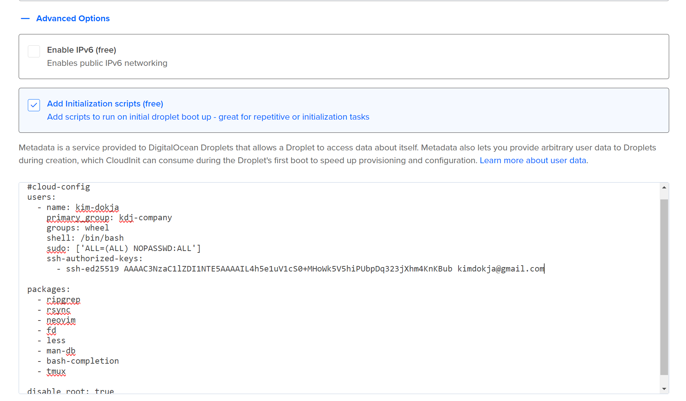

# 2420-assignment-1
## Introduction
In this tutorial, you will be setting up an Arch Linux environment through DigitalOcean. This guide aims to demonstrate:
- [Generating SSH keys on your local machine](#generating-an-ssh-key-on-your-local-machine)
- [Uploading a custom Arch Linux image](#uploading-a-custom-arch-linux-image-to-digitalocean)
- [Setting up a droplet running Arch Linux](#setting-up-a-droplet-using-arch-linux)
- [Using a cloud-init file to automate initial setup tasks](#cloudinit)

## Generating an SSH key on your local machine
Creating an SSH key will be necessary to connect to and authenticate a droplet on DigitalOcean.

As most of you are probably on Windows, create a .ssh directory in your home directory if you haven't yet.


To find your home directory you can type the command:
```
cd ~
```
This command will create the .ssh directory:
```
mkdir .ssh
```

If the creation of the .ssh directory is successful, you can then use this command to generate an SSH key:
```
ssh-keygen -t ed25519 -f ~/.ssh/name-of-key -C "leave your comment here"
```
For Windows users, the command above may not work in PowerShell due to the `~` expansion, so enter the full path.
```
ssh-keygen -t ed25519 -f C:\Users\your-windows-user\.ssh\name-of-key -C "leave your comment here"
```
### Command Breakdown
- `ssh-keygen`: Create the SSH key
- `-t ed25519`: Dictate the type of encryption used, which in this case is ed25519
- `-f ~/.ssh/name-of-key`: Specify the filepath
- `-C "leave your comment here"`: Leave a comment

Replace `name-of-key` with a name for your key, and replace `"leave your comment here"` with a comment to help you identify the key later, like your email address or something helpful.

After running the command, you will be asked to enter a passphrase. This is optional but provides added security. Keep in mind you will need to remember this password everytime you use the SSH key.

> Note: If something went wrong, try going through all the steps again and confirm the steps were followed correctly.

## Adding your public SSH key to DigitalOcean

The public SSH key file will be located in the `~/.ssh` directory and has a `.pub` extension. For example, if you named your key `kim-dokja`, the public key file would be `~/.ssh/kim-dokja.pub`.

You could just open the file in Notepad and copy the content from there, or you could directly copy it to your clipboard using the terminal.

An example in PowerShell would be:

```
Get-Content C:\Users\your-windows-user\.ssh\name-of-key.pub | Set-Clipboard
```

The copied content should look something like this:
 ```
 ssh-ed25519 AAAAC3NzaC1lZDI1NTE5AAAAIL4h5e1uV1cS0+MHoWk5V5hiPUbpDq323jXhm4KnKBub kimdokja@gmail.com
 ```

 ### Adding the public key to your DigitalOcean account
 
 - Head to the **settings page** 
 - Click on the **security tab** and press the **"Add SSH key"** button.
 - Add your public key in the **"SSH Key content"** area
 - Give the SSH key a name for better organization
 - Press **"Add SSH key"** to finalize the process

 **✧Congratulations!✧** You have now generated an SSH key and added it to your DigitalOcean account.


## Uploading a custom Arch Linux image to DigitalOcean

To start, an Arch linux image will need to be downloaded. The file can be found [here](https://gitlab.archlinux.org/archlinux/arch-boxes/-/packages/).

Download the file from the latest **images** package that contains **"cloud-img"** and ends with **".qcow2"**

### On the DigitalOcean website

- Click on the **"Backups & Snapshots"** page from the **"Manage"** dropdown menu
- Click on the blue **"Upload Image"** button
- Select the image file you just downloaded

>Note: When uploading the Arch Linux image, make sure to select **Arch Linux** as the distribution and **San Francisco 3** for the datacenter region as it is the closest server to Vancouver, BC. Or select the region closest to you.

It should look something like this when the upload has completed:


## Setting up a droplet using Arch Linux

>Note: This step will only work if the Arch Linux image has been uploaded **and** an SSH key has been generated

On the DigitalOcean website, there will be a large green button that says **"Create"**, then click on **"Droplets"**.

Select San Francisco • Datacenter 3 for your region and data center.
Next, under **"Choose an image"**, click on the **"Custom images"** tab and select the Arch Linux image you uploaded in the [previous step](#uploading-a-custom-arch-linux-image-to-digitalocean).

### For the rest of the settings you can select:
- **Basic** for the droplet type
- For the CPU option: **Premium AMD** at **$7/mo** or **Premium Intel** at **$8/mo**
- For the authenitcation method choose **SSH Key** and select the key you created in the [first step](#generating-an-ssh-key-on-your-local-machine).

Do not forget to name the droplet either, under **"Hostname"**

If the creation of your droplet was a success, your screen should look something like this: 


**"salvation"** is the name I chose for my droplet and **137.184.4.74** is the IP address of the droplet.

### Connecting to the droplet using your SSH key

In your terminal, input the command:
```
ssh -i .ssh/name-of-key arch@ip-address-of-droplet
```
- `ssh` is the command used to initiate an SSH connection
- `-i` specifies the identity file which is the private key that uses the connection. Where `.ssh/name-of-key` is the path of the identity file (the private key)
- `arch` is the username from the image

>Note: The full path for the SSH key may be necessary if using PowerShell.

To stop the connection, type `exit`.

### Config file

While the above method works fine, it is extra typing. It may be preferable for you to connect through an SSH config file.

If you do not already have a config file in your .ssh directory, you can use use **neovim** to create and edit a file.

Using this command will allow you to create then edit the file with neovim:

```
nvim config
```
>Note: If you get an error, make sure [neovim](https://neovim.io/) is installed on your local machine.
### To edit the file within neovim:
- `i` to enter "Insert mode"
- `Esc` to exit Insert mode 


This is an example of your config file should look like:

```
Host kim-dokja
  HostName 143.198.134.136
  User arch
  PreferredAuthentications publickey
  IdentityFile ~/.ssh/demon-king-of-salvation 
  StrictHostKeyChecking no
  UserKnownHostsFile /dev/null
```
- `143.198.134.136` should be replaced with **your** droplet IP address
- `demon-king-of-salvation` should be replaced with the name you chose for your SSH key file
>Note: If `nvim` was used, type `:wq` to save and exit


Using this command will now allow me to connect to my droplet server:
```
ssh kim-dokja
```
## Using a cloud-init file to automate initial setup tasks

### You will learn how to use a cloud-init configuration file to:
- create a new regular user
- install some initial packages
- add a public ssh key to the authorized_keys file in your new users home directory
- disable root access via ssh

### Before you do anything

Once you have successfully connected to the server, run this command to update the system:
```
sudo pacman -Syu
```
- `sudo` is used to run a command with administrative priviliges, which in this case is necessary since you are updating the system and need access to the important files
- `pacman` is the package manager for Arch linux
- `Syu` is a group of command options
    - `S`: Sync
    - `y`: Refreshes and downloads package database
    - `u`: Upgrades packages

>Note: Avoid partial upgrades like `pacman -Sy`, always run `pacman -Syu` instead 

Run this command to install some packages and dependencies that will be useful later on:
```
sudo pacman -S bash-completion git less man-db neovim
```
These commands are great to use if you are only managing one server, but what if you wanted to set up many more servers? It would be a hassle to individually enter these commands for each instance. This is where **cloud-init** comes in!!
### Cloud-init

To check if cloud-init is running in the server, you can type the command:
```
systemctl status cloud-init
```
An example of what a cloud-init YAML file might look like:
```
#cloud-config
users:
  - name: user-name #change me
    primary_group: group-name #change me
    groups: wheel
    shell: /bin/bash
    sudo: ['ALL=(ALL) NOPASSWD:ALL']
    ssh-authorized-keys:
      - ssh-ed25519 ... #public key goes here

packages:
  - ripgrep
  - rsync
  - neovim
  - fd
  - less
  - man-db
  - bash-completion
  - tmux

disable_root: true
```
This documentation provides an example of a cloud-init YAML file configuration. 
The configuration includes user setup with specified groups, shell, and sudo privileges. 
It also lists packages to be installed and disables the root user.

- `#cloud-config`: Important for the file to get recognized and run.
- `users`: Defines user details such as username, primary group, other groups, shell, sudo privileges, and SSH keys.
- `packages:` Is similar to the sudo pacman command that was utilized earlier, but with this config file, the packages will already be installed for you with the creation of the droplet.
- `disable_root`: A boolean value to disable the root user.


Replace `user-name` and `group-name` with names of your choosing.

>Note: While the YAML file is not directly used as you just copy and paste the contents of the YAML file into DigitalOcean's web console, it is important as provides the proper formatting.

### Using the cloud-init file on DigitalOcean

Using the cloud-init file to run additional initialization scripts on DigitalOcean is very simple. All you need to do is whenever you create a droplet, go to the **Advanced Options** section and click on **Add initialization scripts**. Then, copy and paste the contents of the YAML file you just created.

If done properly your page should look something like this: 



Go ahead and click on **Create Droplet** and you have successfully created a droplet using a cloud-init file!!! **✧Congratulations!✧**

>Note: If you encountered any troubles thoroughly go through each step and ensure no mistake was made.
### References

Arch Linux. (n.d.). Pacman. Retrieved from https://wiki.archlinux.org/title/Pacman

Arch Linux. (n.d.). System maintenance: Upgrading the system. Retrieved from https://wiki.archlinux.org/title/System_maintenance#Upgrading_the_system

Arch Linux. (n.d.). Cloud-init. Retrieved from https://wiki.archlinux.org/title/Cloud-init

Manjaro Linux. (n.d.). Pacman overview. Retrieved from https://wiki.manjaro.org/index.php?title=Pacman_Overview

SSH Academy. (n.d.). SSH command. Retrieved from https://www.ssh.com/academy/ssh/command

Neovim. (n.d.). Neovim documentation. Retrieved from https://neovim.io/doc/user/index.html